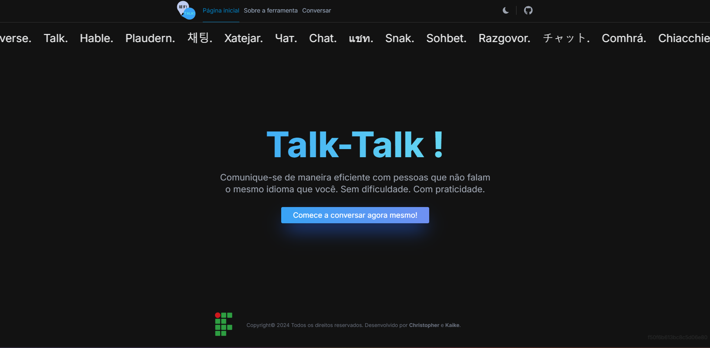

<h1 align="center">Talk-Talk: Chat de tradução em tempo real</h1>



## AVISO: ESTE PROJETO AINDA ESTÁ EM DESENVOLVIMENTO

Este projeto está sendo desenvolvido e mantido pelos alunos Christopher e Kaike, veteranos do curso de Informática do IFPR - Câmpus Assis Chateaubriand.

## Qual nossa proposta?

A nossa proposta é oferecer um ambiente confortável e seguro para duas pessoas conversarem em suas respectivas línguas sem nenhuma dificuldade. Simples, rápido e acessível.

## Como posso contribuir?

Contribuições são sempre bem-vindas! Para contribuir, siga as seguintes etapas:

1. Dê um fork no repositório [clicando aqui](https://github.com/christophergouveia/talktalk/fork)
2. Clone seu código fork `git clone https://github.com/seu_usuario/talktalk`
3. Crie uma nova branch
4. Dê um push nos seus commits
5. Envie um pull request em novo repositório

## Build

1. Clone o repositório: `git clone https://github.com/christophergouveia/talktalk`
2. Vá até a pasta onde o projeto foi clonado e execute:
```bash
npm install
# ou
yarn install
# ou
pnpm install
# ou
bun install
```
3. Execute:

```bash
npm run dev
# or
yarn dev
# or
pnpm dev
# or
bun dev
```

Abra a página [http://localhost:3000](http://localhost:3000) no seu navegador para acessar o projeto
